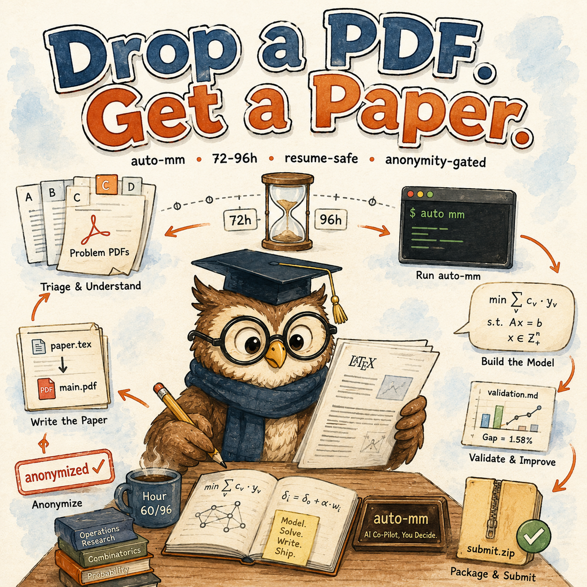
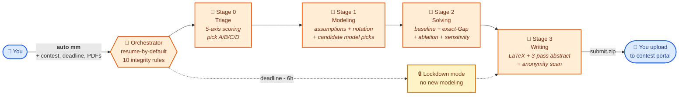

<div align="center">

# 📐 auto-mm

### Drop a Problem PDF. Get a Paper.<br/>72-96 hours · Resume-Safe · Anonymity-Gated.

*Just tell Claude Code or Codex:* **`刷数模`** *or* **`auto mm`**
*→ pick A/B/C/D → formalize → solve → write LaTeX → packaged `submit.zip`.*

<a href="docs/hero.png"></a>

[](#)
[](#)
[](#)
[](https://claude.ai/code)
[](#)
[](auto-mm/SKILL.md)
[](#)

</div>



<div align="center"><sub><i>One contest window. The agent will be killed many times. Every micro-step is idempotent and written through <code>.tmp</code> + rename. <code>supervisor.sh</code> or Claude Code <code>/loop</code> keeps it alive until the deadline (or a <code>STOP</code> file).</i></sub></div>

---

## ✨ What it does

Drop in a mathematical-modeling contest's problem PDFs. The skill suite — five staged Claude / Codex agents — first asks which contest (MCM/ICM or CUMCM or other), gathers the deadline and team info, then runs: **read all problems → score them on a 5-axis rubric → commit to one → formalize the model (assumptions, notation, candidate families) → write code that runs baseline + small-instance exact Gap + ablation + sensitivity sweeps → fill the LaTeX template → iterate the abstract three times until every claim has a hard number → run an anonymity scan that blocks the submission on any author/school/path leak → package `submit.zip`.** You upload the zip. The skill never auto-submits.

**Goal:** turn 72-96 contest hours into a defensible paper instead of a panicked one. **Final submission:** always your call.

## 🚀 In 60 seconds

```bash
# 1) Copy the 5 skill folders into Claude Code (or Codex skills dir)
mkdir -p ~/.claude/skills
cp -r auto-mm auto-mm-triage auto-mm-modeling \
      auto-mm-solving auto-mm-writing ~/.claude/skills/

# 2) Tell Claude Code / Codex (use any of the trigger phrases):
#       刷数模          / auto mm          / 开始数模比赛
#       auto-mm         / MCM              / 国赛  / 美赛
#       继续刷 <slug>   / resume <slug>    / status of my <slug>
```

That's it. First invocation asks you a handful of questions: which contest, year, deadline, team control number, where the problem PDFs live, supervisor mode. After lock-in it runs the four stages in order, pausing on every hand-off so you can sanity-check before the next stage burns hours.

## ⚙️ The 5 skills

| Skill | Role | Reads | Writes |
|---|---|---|---|
| 🎯 [`auto-mm`](auto-mm/SKILL.md) | Orchestrator (routing + integrity gate + time budget, no modeling) | `run.yaml`, all stages' `hand_off.md` | `.heartbeat`, `progress.jsonl` |
| 📂 [`auto-mm-triage`](auto-mm-triage/SKILL.md) | Stage 0: index problems, recon attachment data, 5-axis score, lock A/B/C/D | `inputs/problems/`, `inputs/data/` | `problem_choice.md`, `data_recon.md`, `selection_scorecard.md` |
| 📐 [`auto-mm-modeling`](auto-mm-modeling/SKILL.md) | Stage 1: assumptions, notation, 2-4 candidates, commit one formal model + real citations | `inputs/problems/<X>.pdf`, `data_recon.md` | `model.md`, `notation.md`, `assumptions.md`, `literature.md` |
| 🧪 [`auto-mm-solving`](auto-mm-solving/SKILL.md) | Stage 2: pipeline.py + baseline + exact-Gap + ablation + sensitivity + figures via `brief → prompt → generate → self-check` | `model.md`, `inputs/data/` | `pipeline.py`, `validation.md`, `sensitivity.md`, `figures/<fig_id>/` |
| 📄 [`auto-mm-writing`](auto-mm-writing/SKILL.md) | Stage 3: drop into template, fill sections, iterate abstract 3 times, anonymity scan, package `submit.zip` | all upstream `hand_off.md` + artifacts | `paper/main.pdf`, `submission/submit.zip`, `anonymity_report.json` |

Plus the bundled LaTeX templates under `auto-mm-writing/assets/`: a fully-stripped **EasyMCM2** scaffold for MCM/ICM (DWTS example removed; placeholders only), and a placeholder slot for **CUMCM** (year-by-year template; bring your own at first invocation).

## 📁 What ends up on disk

```text
runs/<run_slug>/                  # e.g. mcm-2026-C, cumcm-2026-A, huazhongbei-2025-A
├── run.yaml                      # contest meta + time budget + chosen problem + supervisor
├── .heartbeat                    # {stage, substep, ts_utc, pid, deadline_remaining_h}
├── progress.jsonl                # append-only micro-step log
├── inputs/                       # everything the user dropped in: problems/, data/, notices/
├── stage0_triage/                # contest_brief.md, problems_index.md, problem_choice.md
├── stage1_modeling/              # problem_decomposition.md, assumptions.md, notation.md,
│                                 # candidates.md, model.md, literature.md
├── stage2_solving/               # pipeline.py, src/, runs/<exp_id>/, figures/<fig_id>/,
│                                 # validation.md, sensitivity.md, leaderboard.csv
├── stage3_writing/               # paper/main.pdf, abstract_draft.md, anonymity_report.json,
│                                 # submission/<root>/, submission/submit.zip
└── STOP | PAUSE                  # touch to stop / pause cleanly
```

Each figure inside `stage2_solving/figures/<fig_id>/` has its own `brief.md` (the spec), `prompt.md` (the generation prompt), `source/` (matplotlib or TikZ code, or an image-gen request), `output.pdf`, `self_check.md` (style-rule audit), and a `status` file. The approved copy lands at `figures/<fig_id>.pdf` for LaTeX to pick up.

## 🔥 Why it doesn't die mid-run

A 数模 contest runs 72-96 hours and the agent will be killed many times (context fills, laptop closes, you sleep). The skill is built to come back:

| Failure | What survives | Why |
|---|---|---|
| Claude Code `/clear` | Everything | Zero memory crosses invocations — all state on disk |
| Mid-experiment crash | All prior exp_ids | Per-run `result.json` is atomic; `leaderboard.csv` is rebuilt from disk |
| Mid-xelatex failure | `.tex` sources | Build is reproducible from the same sources; helper script logs every pass |
| Anonymity hit | Your paper | Scanner returns non-zero and **blocks** `submit.zip` until you redact |
| Host reboot | All state | Atomic `.tmp` + rename for every write; `supervisor.sh` restarts the agent |
| You pause (sleep, food, panic) | Time budget | `PAUSE` freezes budget accounting; the hard deadline keeps moving (honest dual clock) |
| Last 6 hours | The whole paper | Lockdown mode rejects new modeling/experiments; only writing/anonymity/packaging |

Three supervisor modes — pick by how long you can keep something running:

```bash
# (A) manual — you invoke whenever
> auto mm <run_slug>

# (B) Claude Code /loop — runs while Claude Code is open
> /loop /auto-mm resume <run_slug>

# (C) shell-supervisor — runs across crashes from outside Claude Code
nohup bash auto-mm/assets/supervisor.sh <run_slug> > supervisor.log 2>&1 &
```

## 📜 Integrity rules

10 non-negotiables — full text in [`auto-mm/references/integrity-rules.md`](auto-mm/references/integrity-rules.md). Each is enforced at a specific hand-off gate:

1. **Problem statement is authoritative.** Problem says 30 customers → main model uses 30; alternative interpretations go into sensitivity only.
2. **Anonymity is absolute.** No author / school / `/Users/<name>` / git-remote leakage in PDF metadata, body text, source, or code listings. Scanner is blocking.
3. **Real citations only.** Every `references.bib` entry must verify on doi.org / arxiv.org / stable URL before it lands. No training-data memory.
4. **AI/ML must address real uncertainty.** No neural net to predict a value the cost function can compute in closed form.
5. **Algorithms justified by problem structure.** Each metaheuristic component answers "what problem feature does this address?" — no SA+TS+GA+DRL stacking without reasons.
6. **Validation is part of the deliverable.** At least 3 of {baseline, small-instance exact Gap, ablation, cross-method comparison}, with at least one of {exact-Gap, ablation}.
7. **Time budget is hard.** Stage drift >20% triggers user escalation (cut scope / steal from later stage / extend total).
8. **Figures are evidence, not decoration.** Every figure is `\ref`-ed from prose; AI-flavored palettes / decorative icons / drop shadows are flagged by self-check.
9. **Abstract carries hard numbers.** ≥5 unique numeric tokens, every one traceable to `validation.md` or `sensitivity.md`. The phrase "good results" is rejected.
10. **Submission package hygiene.** No `._*`, `.DS_Store`, `~$*`, `__pycache__/` in the zip; decompresses cleanly.

---

<details>
<summary><b>🆕 New to 数模 contests? Read this first.</b></summary>

### Who this is for

- You are a team (or solo with Claude as your teammate) running MCM/ICM, CUMCM (国赛), or a derivative contest (华中杯, 妈杯, 数维杯, 校赛).
- You have a hard deadline and a fixed problem PDF.
- You can stay on call during the contest window to make the high-leverage decisions (problem choice, model family commit, ship/no-ship on the abstract).
- You have a Linux/macOS machine with `xelatex` installed (TeX Live full or BasicTeX + the required packages).

### Who this is **not** for

- People who've never written a 数模 paper — read one award paper end-to-end first. The skill cannot make up for missing structural intuition.
- People who want to bypass anonymity rules — Rule 2 blocks all of this.
- People targeting non-contest scientific papers — use [`auto-research`](https://github.com/deafenken/auto-research) instead (different rubric, different time scale, peer review iteration).
- People who want it to auto-submit — the skill packages `submit.zip` and stops. The human uploads to the portal.

### Walk through it once before targeting a real contest

1. **Pick a past problem you already know the answer to.** Run the skill end-to-end on it. You see how the four stages flow, what each `hand_off.md` looks like, how the anonymity scan behaves, how `submit.zip` lands.
2. **Practice on a recent year's problem with no time pressure.** Let yourself disagree with the skill's calls — when it picks model family A and you would have picked B, look at the `candidates.md` and figure out who's right.
3. **Then point it at a real contest.** First-invocation flow will guide the questions.

### Vocabulary

- **MCM / ICM**: COMAP's Mathematical / Interdisciplinary Contest in Modeling. 96 hours. English paper, max 25 pages incl. memo, excl. references + AI report.
- **CUMCM**: 全国大学生数学建模竞赛 (高教社杯). 72 hours. 中文 paper, 25 pages incl. references.
- **Hand-off**: each stage writes `hand_off.md` with three sections (What I did / What's true now / What you should do next). The next stage reads only this file + the structured files it cites.
- **Lockdown mode**: last 6 hours before deadline; orchestrator refuses new modeling/experiments; only writing/build/anonymity/packaging.
- **Brief → prompt → generate → self-check**: the four-step figure pipeline. Every figure has a folder.

</details>

<details>
<summary><b>🛠 Installation</b></summary>

### Claude Code

```bash
mkdir -p ~/.claude/skills
cp -r auto-mm auto-mm-triage auto-mm-modeling \
      auto-mm-solving auto-mm-writing ~/.claude/skills/
```

Or project scope: `<project>/.claude/skills/`. Then `/skills` to confirm all 5 names appear.

### Codex / OpenAI-compatible agents

Drop the same five folders into your Codex skills directory; each skill's `agents/openai.yaml` provides UI metadata.

### LaTeX toolchain

```bash
# macOS (BasicTeX or full TeX Live)
brew install --cask mactex          # full; recommended
# or
brew install --cask basictex
sudo tlmgr install xetex collection-fontsrecommended \
                   easymcm2 cleveref tikz pgf algorithm2e \
                   minted matlab-prettifier xeCJK

# Ubuntu / Debian
sudo apt install texlive-xetex texlive-latex-extra texlive-fonts-extra \
                 texlive-bibtex-extra texlive-lang-chinese
```

Verify: `xelatex --version` should report a recent version (≥2022 OK).

### Python helpers (for `anonymity_scan.py`)

```bash
pip install pdfminer.six PyPDF2 PyYAML
```

### CUMCM template (国赛 only)

The 高教社 official template is **not bundled** (it changes year to year; license terms vary). Before your first CUMCM run, drop the year's template into `auto-mm-writing/assets/cumcm-template/`. The writing stage refuses to proceed without it.

</details>

<details>
<summary><b>📂 Repo layout</b></summary>

```text
auto-mm/                          # orchestrator + state contract + integrity rules + supervisor.sh
  ├── SKILL.md
  ├── agents/openai.yaml
  ├── assets/supervisor.sh
  └── references/                 # state-contract / integrity-rules / time-budget /
                                  # long-running-protocol / escalation-policy / contest-types
auto-mm-triage/                   # Stage 0
auto-mm-modeling/                 # Stage 1
auto-mm-solving/                  # Stage 2 (+ figure-{types-catalog,workflow,sourcing}.md + download_image.py)
auto-mm-writing/                  # Stage 3 (+ EasyMCM2 scaffold + anonymity_scan.py + build.sh)
docs/hero.png                     # README banner
README.md  README.zh-CN.md
CLAUDE.md                         # editor notes for Claude Code
```

Each skill folder has `SKILL.md` (workflow), `references/` (load-on-demand specs), `assets/` (helpers + templates), and `agents/openai.yaml` (Codex UI metadata).

</details>

<details>
<summary><b>📝 Notes (not legal advice)</b></summary>

- This is **infrastructure for running 数模 contests**, not a disclaimer: if you violate a contest's anonymity / academic-integrity rules, your team is still on the line.
- The skill **never auto-submits** — Rules 2 + 7 + 10 force user confirmation before `submit.zip` ships.
- The skill **never modifies** `assumptions.md` after Stage 1 commits — once locked, only the user edits.
- Contest data lives under `runs/<run_slug>/inputs/` and is `.gitignored`. Never commit.
- The author's past 数模 retrospective (a private document) was distilled into [`auto-mm-modeling/references/pitfalls-from-experience.md`](auto-mm-modeling/references/pitfalls-from-experience.md) — 14 named anti-patterns from real contest experience.

</details>

---

<div align="center"><sub>
中文版 → <a href="README.zh-CN.md">README.zh-CN.md</a> · Sister projects: <a href="https://github.com/deafenken/auto-kaggle">auto-kaggle</a> · <a href="https://github.com/deafenken/auto-research">auto-research</a>
</sub></div>
