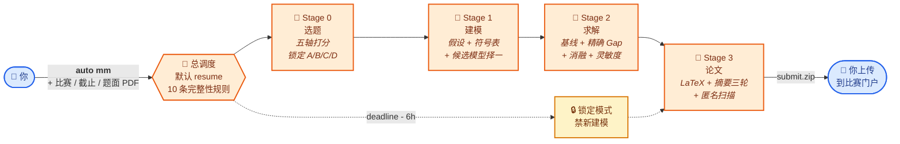

<div align="center">

# 📐 auto-mm

### 丢一份题面 PDF，拿一篇论文<br/>72-96 小时 · 断点续跑 · 匿名性硬关卡

*在 Claude Code 或 Codex 里说：* **`刷数模`** *或者* **`auto mm`**
*→ 选 A/B/C/D → 形式化建模 → 求解 → 写 LaTeX → 打包好的 `submit.zip`。*

<!-- 把一张 1254x1254 PNG 放到 docs/hero.png 就能开启横幅。生成 prompt：docs/hero-prompt.md。
<a href="docs/hero.png"></a>
-->

[](#)
[](#)
[](#)
[](https://claude.ai/code)
[](#)
[](auto-mm/SKILL.md)
[](#)

</div>



<div align="center"><sub><i>一个比赛窗口；agent 会被打死很多次。每个微步骤幂等、写盘走 <code>.tmp</code> + rename。<code>supervisor.sh</code> 或 Claude Code <code>/loop</code> 续命直到 deadline（或一个 <code>STOP</code> 文件）。</i></sub></div>

---

## ✨ 它能做什么

把数模比赛的题面 PDF 丢进去。五个分阶段的 Claude / Codex agent 会先问你比赛类型（美赛 MCM/ICM、国赛 CUMCM、或其他），收齐 deadline 和队伍信息，然后跑：**通读 A/B/C/D 题面 → 五轴打分 → 锁定一题 → 形式化建模（假设、符号、候选模型）→ 写代码跑基线 + 小算例精确解 Gap + 消融 + 灵敏度扫描 → 填 LaTeX 模板 → 摘要三轮迭代直到每个数字都可追溯 → 跑匿名扫描，发现作者/学校/路径泄露就阻断 → 打包 `submit.zip`。** 你上传。Skill 永远不会自动提交。

**目标**：把 72-96 小时变成一篇能defended 的论文，而不是赶出来的一沓。**最终提交**：永远是你的决定。

## 🚀 60 秒上手

```bash
# 1) 把 5 个 skill 文件夹拷到 Claude Code（或 Codex）的 skills 目录
mkdir -p ~/.claude/skills
cp -r auto-mm auto-mm-triage auto-mm-modeling \
      auto-mm-solving auto-mm-writing ~/.claude/skills/

# 2) 在 Claude Code / Codex 里说（任一触发短语即可）：
#       刷数模           / auto mm           / 开始数模比赛
#       auto-mm          / MCM               / 国赛  / 美赛
#       继续刷 <slug>    / resume <slug>     / status of my <slug>
```

就这样。首次触发会问几个问题：哪个比赛、年份、deadline、控制号、题面 PDF 放在哪、supervisor 模式。锁好之后按四个阶段顺序跑，每个 hand-off 都会停下来让你确认，然后下个阶段才开烧时间。

## ⚙️ 5 个 skill

| Skill | 角色 | 读 | 写 |
|---|---|---|---|
| 🎯 [`auto-mm`](auto-mm/SKILL.md) | 总调度（路由 + 完整性门禁 + 时间预算，自己不建模） | `run.yaml`，所有 stage 的 `hand_off.md` | `.heartbeat`，`progress.jsonl` |
| 📂 [`auto-mm-triage`](auto-mm-triage/SKILL.md) | Stage 0：索引题面、侦察附件数据、五轴打分、锁定 A/B/C/D | `inputs/problems/`、`inputs/data/` | `problem_choice.md`、`data_recon.md`、`selection_scorecard.md` |
| 📐 [`auto-mm-modeling`](auto-mm-modeling/SKILL.md) | Stage 1：假设、符号、2-4 个候选、择一形式化 + 真 citation | `inputs/problems/<X>.pdf`、`data_recon.md` | `model.md`、`notation.md`、`assumptions.md`、`literature.md` |
| 🧪 [`auto-mm-solving`](auto-mm-solving/SKILL.md) | Stage 2：pipeline.py + 基线 + 精确 Gap + 消融 + 灵敏度 + 图（`brief → prompt → generate → self-check`） | `model.md`、`inputs/data/` | `pipeline.py`、`validation.md`、`sensitivity.md`、`figures/<fig_id>/` |
| 📄 [`auto-mm-writing`](auto-mm-writing/SKILL.md) | Stage 3：拷模板、填章节、摘要三轮迭代、匿名扫描、打包 `submit.zip` | 所有上游 `hand_off.md` 和产物 | `paper/main.pdf`、`submission/submit.zip`、`anonymity_report.json` |

外加 `auto-mm-writing/assets/` 里的 LaTeX 模板：**EasyMCM2** 占位 scaffold（DWTS 示例已清空，全是 placeholder），和 **CUMCM** 的占位槽（年度模板会变，首次启动时自带）。

## 📁 跑起来后磁盘上是什么样

```text
runs/<run_slug>/                  # 比如 mcm-2026-C, cumcm-2026-A, huazhongbei-2025-A
├── run.yaml                      # 比赛元信息 + 时间预算 + 选定题号 + supervisor
├── .heartbeat                    # {stage, substep, ts_utc, pid, deadline_remaining_h}
├── progress.jsonl                # append-only 微步骤日志
├── inputs/                       # 你丢进来的：problems/、data/、notices/
├── stage0_triage/                # contest_brief.md、problems_index.md、problem_choice.md
├── stage1_modeling/              # problem_decomposition.md、assumptions.md、notation.md、
│                                 # candidates.md、model.md、literature.md
├── stage2_solving/               # pipeline.py、src/、runs/<exp_id>/、figures/<fig_id>/、
│                                 # validation.md、sensitivity.md、leaderboard.csv
├── stage3_writing/               # paper/main.pdf、abstract_draft.md、anonymity_report.json、
│                                 # submission/<root>/、submission/submit.zip
└── STOP | PAUSE                  # touch 一下就能干净停止 / 暂停
```

`stage2_solving/figures/<fig_id>/` 里每张图都有自己的文件夹：`brief.md`（spec）、`prompt.md`（生成提示词）、`source/`（matplotlib / TikZ 源码或图生成请求）、`output.pdf`、`self_check.md`（style 自查）、一个 `status` 文件。审过的版本会复制到 `figures/<fig_id>.pdf` 供 LaTeX 引用。

## 🔥 为什么它不会半路死掉

数模比赛 72-96 小时，agent 会被打死很多次（context 满、合上电脑、睡觉）。Skill 设计成会自己回来：

| 故障 | 什么活下来 | 为什么 |
|---|---|---|
| Claude Code `/clear` | 一切 | 跨调用零内存；所有状态都在盘上 |
| 实验中途崩 | 之前所有的 exp_id | 每个 `result.json` 原子写；`leaderboard.csv` 从盘上重建 |
| xelatex 失败 | `.tex` 源文件 | build 从同一份源可复现；helper 日志记录每一遍 |
| 匿名扫描命中 | 你的论文 | scanner 返回非零，**阻断** `submit.zip`，直到你去脱敏 |
| 主机重启 | 所有状态 | 每次写盘都是 `.tmp + rename` 原子；`supervisor.sh` 重启 agent |
| 你暂停（睡觉、吃饭、慌乱） | 时间预算 | `PAUSE` 冻结预算账目；但硬 deadline 不会暂停（两个时钟诚实并存）|
| 最后 6 小时 | 整篇论文 | 锁定模式拒绝新建模/新实验，只许写论文、编译、匿名、打包 |

三种 supervisor 模式 —— 看你能撑多久：

```bash
# (A) manual — 你想啥时候调就啥时候调
> auto mm <run_slug>

# (B) Claude Code /loop — Claude Code 开着就一直跑
> /loop /auto-mm resume <run_slug>

# (C) shell-supervisor — Claude Code 之外也能续命
nohup bash auto-mm/assets/supervisor.sh <run_slug> > supervisor.log 2>&1 &
```

## 📜 10 条完整性规则

不可让步的硬规则 —— 全文在 [`auto-mm/references/integrity-rules.md`](auto-mm/references/integrity-rules.md)。每条都对应一个 hand-off 门禁：

1. **题面口径优先**。题面说 30 个客户，主模型就用 30；其他解读只能进灵敏度。
2. **匿名性绝对**。PDF 元数据、正文、源码、code listing 里出现作者 / 学校 / `/Users/<name>` / git remote 一律阻断。扫描器是 blocking 的。
3. **真 citation only**。每条 `references.bib` 都要在 doi.org / arxiv.org / 稳定 URL 验证过才能落盘。不许凭记忆。
4. **AI/ML 要服务真实不确定性**。不许用神经网络去预测一个目标函数闭式可算的量。
5. **算法要被问题结构证明合理**。每个元启发式组件都得说"它解决问题的哪个特征" —— 不许 SA+TS+GA+DRL 不解释就堆。
6. **验证是交付的一部分**。基线 + 小算例精确 Gap + 消融 + cross-method 这 4 项，至少 3 项要有，其中至少含 {精确 Gap, 消融} 之一。
7. **时间预算是硬约束**。阶段超 20% 触发用户决策（砍 scope / 借时间 / 加总预算）。
8. **图是证据不是装饰**。每张图都要被正文 `\ref`；AI 感配色 / 装饰图标 / 阴影会被 self-check 标记。
9. **摘要必须有硬数字**。至少 5 个可数验的数字，每个都能在 `validation.md` 或 `sensitivity.md` 找到。"我们取得了较好的结果"被拒。
10. **提交包卫生**。zip 里没有 `._*`、`.DS_Store`、`~$*`、`__pycache__/`；能干净解压。

---

<details>
<summary><b>🆕 没打过数模？先读这个。</b></summary>

### 适用人群

- 三人队伍（或单人 + Claude 当队友）打 MCM/ICM、国赛 CUMCM、或衍生赛（华中杯、妈杯、数维杯、校赛）。
- 你有一个硬 deadline 和一份固定的题面 PDF。
- 比赛窗口内你能 on call 做高杠杆决策（选题、模型族 commit、ship/不 ship 摘要）。
- Linux / macOS 机器装好 `xelatex`（TeX Live 全套，或 BasicTeX + 必要包）。

### 不适合的人

- 没写过数模论文的 —— 先读一篇国一/Outstanding 论文从头到尾。Skill 替代不了结构直觉。
- 想绕过匿名规则的 —— 规则 2 全堵了。
- 想发 SCI / 顶会的 —— 用 [`auto-research`](https://github.com/deafenken/auto-research)，它的 rubric / 时间尺度 / 同行评议迭代都不一样。
- 想 auto-submit 的 —— Skill 打包到 `submit.zip` 就停。人去门户上传。

### 真打比赛前先空跑一遍

1. **找一个你已经知道答案的往年题**，端到端跑一遍 skill。你会看到四个 stage 怎么流转、每个 `hand_off.md` 长什么样、匿名扫描怎么响、`submit.zip` 怎么落。
2. **挑近年一个没时间压力的真题练。** 允许自己跟 skill 唱反调 —— 当它选模型族 A，你想选 B 的时候，去看 `candidates.md`，搞清楚是谁对。
3. **然后再打真比赛。** First-invocation 流程会把问题问全。

### 词汇

- **MCM / ICM**：COMAP 的美赛。96 小时。英文论文，主体最多 25 页（含 memo，不含参考文献和 AI Report）。
- **CUMCM**：全国大学生数学建模竞赛（高教社杯）。72 小时。中文论文，25 页含参考文献。
- **Hand-off**：每个 stage 写一份 `hand_off.md`，三段固定结构（我做了什么 / 现在事实是什么 / 你下一步该做什么）。下一阶段只读这个文件和它点名的结构化文件。
- **锁定模式**：deadline 前最后 6 小时；orchestrator 拒绝新建模 / 新实验，只允许写论文 / 编译 / 匿名 / 打包。
- **brief → prompt → generate → self-check**：四步图生成流水线。每张图一个文件夹。

</details>

<details>
<summary><b>🛠 安装</b></summary>

### Claude Code

```bash
mkdir -p ~/.claude/skills
cp -r auto-mm auto-mm-triage auto-mm-modeling \
      auto-mm-solving auto-mm-writing ~/.claude/skills/
```

或者项目作用域：`<project>/.claude/skills/`。然后 `/skills` 确认 5 个名字都出现。

### Codex / OpenAI 兼容 agent

把同样 5 个文件夹丢进 Codex 的 skills 目录；每个 skill 的 `agents/openai.yaml` 提供 UI 元数据。

### LaTeX 工具链

```bash
# macOS（BasicTeX 或 全套 TeX Live）
brew install --cask mactex          # 全套，推荐
# 或者
brew install --cask basictex
sudo tlmgr install xetex collection-fontsrecommended \
                   easymcm2 cleveref tikz pgf algorithm2e \
                   minted matlab-prettifier xeCJK

# Ubuntu / Debian
sudo apt install texlive-xetex texlive-latex-extra texlive-fonts-extra \
                 texlive-bibtex-extra texlive-lang-chinese
```

验证：`xelatex --version` 应该报 2022 以上版本。

### Python 辅助（给 `anonymity_scan.py`）

```bash
pip install pdfminer.six PyPDF2 PyYAML
```

### 国赛模板（CUMCM only）

高教社官方模板**没有**打进包里（年年变、license 不一）。第一次跑国赛前，把当年模板丢进 `auto-mm-writing/assets/cumcm-template/`。写作阶段没模板就拒绝继续。

</details>

<details>
<summary><b>📂 仓库结构</b></summary>

```text
auto-mm/                          # orchestrator + state contract + integrity rules + supervisor.sh
  ├── SKILL.md
  ├── agents/openai.yaml
  ├── assets/supervisor.sh
  └── references/                 # state-contract / integrity-rules / time-budget /
                                  # long-running-protocol / escalation-policy / contest-types
auto-mm-triage/                   # Stage 0
auto-mm-modeling/                 # Stage 1
auto-mm-solving/                  # Stage 2（+ figure_style.py + figure-* workflow refs）
auto-mm-writing/                  # Stage 3（+ EasyMCM2 scaffold + anonymity_scan.py + build.sh）
docs/hero-prompt.md               # README 横幅图的生成提示词；图丢这里就生效
README.md  README.zh-CN.md
CLAUDE.md                         # 给 Claude Code 维护者看的 notes
```

每个 skill 文件夹结构一致：`SKILL.md`（工作流）、`references/`（按需加载的 spec）、`assets/`（helper 和模板）、`agents/openai.yaml`（Codex UI 元数据）。

</details>

<details>
<summary><b>📝 注意事项（非法律意见）</b></summary>

- 这是**比赛基础设施**，不是免责声明：你如果违反比赛的匿名 / 学术诚信规则，账号还是你的。
- Skill **永远不会自动提交** —— 规则 2 + 7 + 10 强制人工确认才放行 `submit.zip`。
- Skill **不会在 Stage 1 commit 之后改 `assumptions.md`** —— 一旦锁定，只有用户能改。
- 比赛数据在 `runs/<run_slug>/inputs/` 下，`.gitignore` 排除。永远别 commit。
- 作者过往的一次数模复盘（私有文档）已经蒸馏到 [`auto-mm-modeling/references/pitfalls-from-experience.md`](auto-mm-modeling/references/pitfalls-from-experience.md) —— 14 条来自真实赛事的具名 anti-pattern。

</details>

---

<div align="center"><sub>
English → <a href="README.md">README.md</a> · Sister projects：<a href="https://github.com/deafenken/auto-kaggle">auto-kaggle</a> · <a href="https://github.com/deafenken/auto-research">auto-research</a>
</sub></div>
